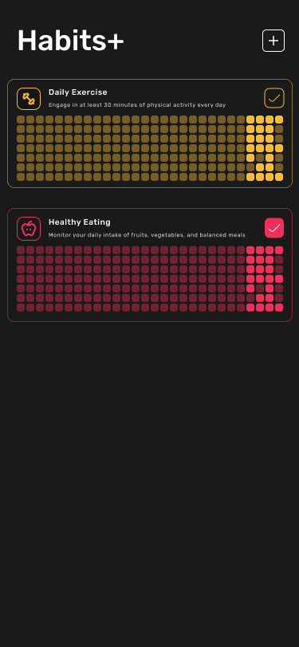
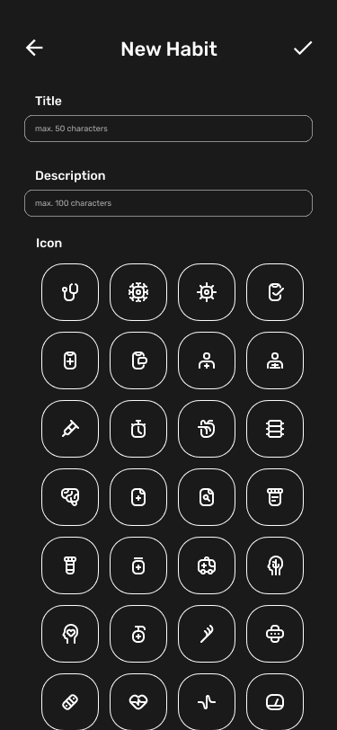

# HabitPulse

<div align="center">
  
</div>

## 📱 About HabitPulse

HabitPulse is a powerful habit tracking application built with React Native that helps you create, maintain, and monitor your daily habits. Whether you're trying to exercise more, read daily, or build any other positive habit, HabitPulse provides the tools you need to stay on track.

## 🖼️ Screenshots

<div align="center">
  
  
</div>

## 🚀 Getting Started

### Prerequisites

- Node.js (v20 or higher)
- npm
- React Native development environment setup

### Installation

```bash
npm ci --include=dev
```

### Run with platform selection

```bash
npm run start
```

#### Android specific

```bash
npm run android
```

#### iOS specific

```bash
npm run ios
```

#### Web specific

```bash
npm run web
```

### Development

#### Run tests

```bash
npm run test
```

#### Run tests in watch mode

```bash
npm run test:watch
```

#### Check linting

```bash
npm run lint
```

## 📄 License

This project is licensed under the MIT License - see the [LICENSE](LICENSE) file for details.
